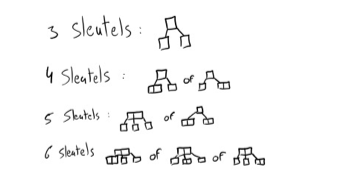
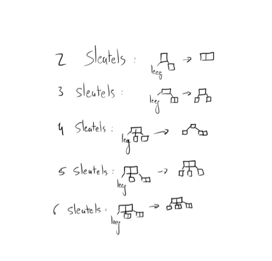
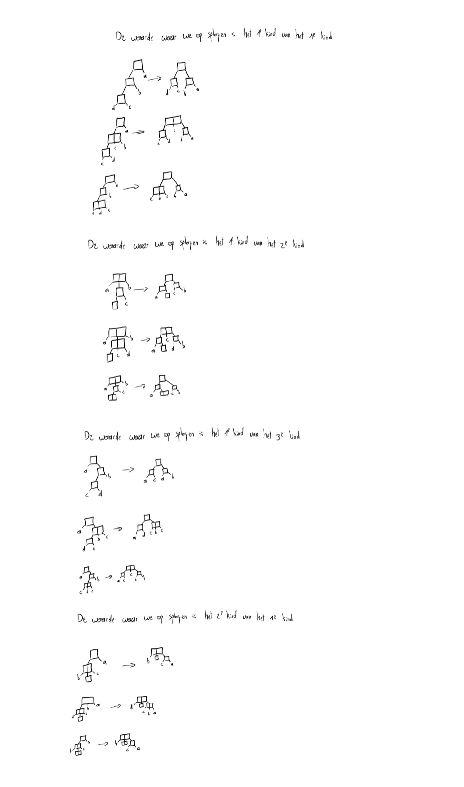
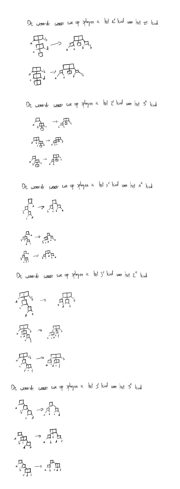
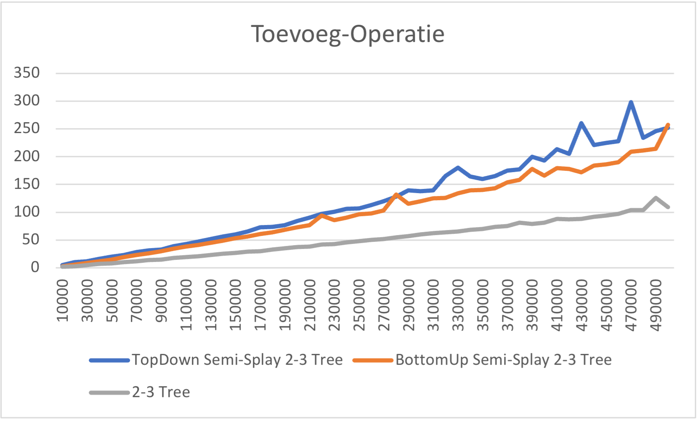
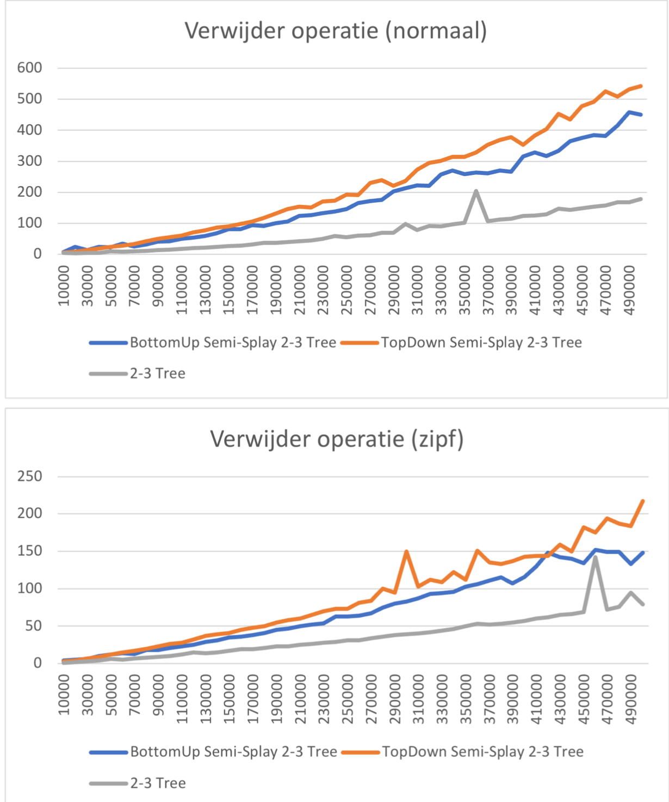
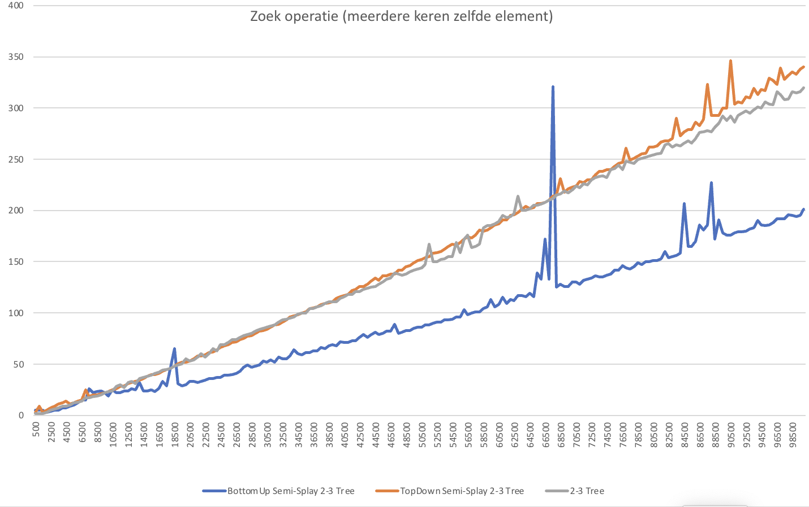
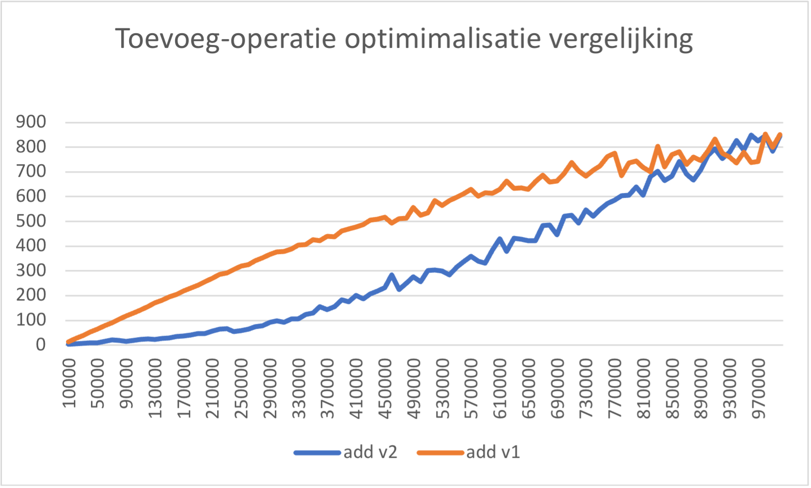

# 
Verslag Project Algortimen en Datastructuren

Verslag door Dries Huybens, informatica ba2 2022-2023

## Inleiding

In dit project hebben we een normale 2-3 boom, een 2-3 boom met semi-splay die via de Bottom-Up manier werkt en een 2-3 boom met semi-splay die via de Top-Down manier werkt moeten maken.

In dit verslag ga ik bespreken welke van de drie het efficientst is per scenario, we zullen het toevoegen, verwijderen en opzoeken van een element bespreken. We gaan dit zowel doen op een normale manier waarop de elementen steeds in dezelfde volgorde verwijderd worden als ze werden toegevoegd, en wanneer ze op een willekeurige volgorde worden verwijderd. (alle gebruikte afbeeldingen bevinden zich ook in het verslag mapje voor een eventuele hogere resolutie)

## Implementatie

### <strong>2-3 Boom</strong>

De implementatie van mijn 2-3 boom werkt als volgt, bij het toevoegen probeer ik eerst de nieuwe waarde aan een blad toe te voegen, als dat lukt zijn we er klaar mee. Mocht het niet lukken maak ik een nieuw blad aan en maak ik een vervangboom van het nieuwe blad, zijn vader en zijn grootvader gebaseerd op het totaal aantal sleutels in die drie toppen. Bij het verwijderen, als een blad met 2 sleutels verwijderd word verwijder ik gewoon de waarde uit dat blad. Mocht het blad slechts 1 sleutel hebben dan maak ik van die top een lege top en vervang ik deze door door hem mee te geven aan mijn methode 'removeEmpty' die een leeg blad gaat wegwerken. Dit gebeurt door een aantal vervangbomen die hieronder te zien zullen zijn. Als de te verwijderen waarde zich niet in een blad bevind ga ik deze proberen vervangen met het grootste linkerkind of kleinste rechterkind afhankelijk van welke sleutel er verwijderd word. Dan is het mogelijk dat dit blad waaruit de vervangende sleutel komt nu een leeg kind is en via mijn methode 'removeEmpty' zal moeten geherbalanceerd worden.

Mijn vervangenbomen van mijn normale 2-3 boom zijn hieronder te zien.

Mijn vervangbomen voor het wegwerken van een lege top zijn hieronder te zien.

### <strong>Top-down- & Bottom-up Semi-Splay 2-3 Boom</strong>

#### Vervang bomen

De vervangenbomen die ik voor mijn semi splay gebruikt heb zijn te zien in de onderstaande afbeeldingen. Ik heb zoveel mogelijk geprobeerd op toppen te splitsen en niet op sleutels. Ik verwacht dat op sleutels splitsen efficienter was geweest aangezien je dan meer toppen zou samenvoegen en dus vaker gebruik maakt van de 2-3 eigenschappen van de boom, maar dit leken mij al heel snel heel veel situaties die ik ging moeten coderen.

#### Bottom-up Semi-Splay 2-3 Boom

De implementatie voor mijn Bottom-up boom werkt als volgt, ik geef een node mee aan mijn splay methode die dan vervolgens steeds drie nodes, de vader en grootvader gaat samennemen en door een vervangboom gaat vervangen. Hierna splay ik nog eens op de node boven de vervangboom zodat die ook door een vervangboom vervangen word. Dit blijf ik doen tot ik aan een kind van de wortel of de wortel zit.

####  Top-down Semi-Splay 2-3 Boom

Mijn Top-down boom zijn splay methode begint te splayen bij de wortel en geef ik de waarde mee die ik zoek. Hij gaat steeds een vervangboom maken van de postities waar het mogelijk zou kunnen zijn waar de gezochte waarde zit. Hij gaat steeds zo een stap naar beneden tot hij bij de gezochte waarde terechtkomt. Ik zoek eerst mijn node op waar ik de waarde aan zou toevoegen of uit zou verwijderen. Het zou efficienter zijn als ik terwijl ik splay die waarde uiteindelijk toevoeg/verwijder. Dit zou er voor zorgen dat ik een keer minder het pad zou moeten doorlopen.

## Benchmarks

### <strong>Het toevoegen van elementen</strong>

Het testen van het toevoegen van elementen heb ik gedaan door 50 maal een boom op te bouwen met eerst 10.000 elementen dan 20.000, 30.000...50 000 elementen. 

Zoals u hieronder op de grafiek kan zien is de gewone 2-3 boom veruit het efficienst. Dit komt natuurlijk doordat we hier niet moeten splayen waar uitendelijk steeds wel een aantal operaties voor nodig zijn. Het is ook opmerkelijk dat Top-down net iets trager is dan Bottom-up, dit komt door het feit dat ik eigenlijk twee keer zoek naar in node in mijn Top-down implementatie.

### <strong>Het verwijderen van elementen</strong>

Het testen van het toevoegen van elementen heb ik weer gedaan door 50 maal een boom op te bouwen met eerst 10.000 elementen dan 20.000, 30.000...50 000 elementen. Deze keer gaan we ook vergelijken of er een verschil is als we de elementen in dezelfde volgorde verwijderen als we ze hebben toegevoegd.

Net zoals bij de toevoeg operatie is de 2-3 boom opnieuw het efficientst. Dit komt alweer door dezelfde reden, er worden geen splay operaties uitgevoerd. De Bottom-Up manier is net weer iets meer performant dan de Top-Down manier. We zien wel geen verschil in verhouding als we verwijderen in dezelfde volgorde als we de elementen hebben toegevoegd tegenover als we ze verwijderen in een willekeurige volgorde.

### <strong>Het zoeken van elementen</strong>

Het testen van het zoeken is op exact dezelfde manier gebeurt als de testen hiervoor. Er was geen verschil tussen de verhoudingen van snelheid als we in willekeurige volgorde zochten of in dezelfde manier als we de elementen toegevoegd hadden. Top-down is weeral net iets trager dan Bottom-up door het feit dat we hier alweer een extra zoek operatie uitvoeren. Het verhaal blijft ook weer hetzelfde met het feit dat de 2-3 Boom het meest performant is dankzij het feit dat deze boom geen splay operaties moet uitvoeren.

;

Ik wou ook graag nog eens zien of deze semi-splay methode effectief efficienter zou worden als we hetzelfde elementen meerdere keren achter elkaar zouden opzoeken. In deze test heb ik 100 keer na elkaar hetzelfde element opgezocht en hier blinkt de efficientie van de Semi-Splay toch echt uit, vooral op de Bottom-up implementatie die geen extra zoekoperatie moet doen zoals de Top-down implementatie. De Bottom-up is hier toch wel wat sneller dan de normale 2-3 Boom terwijl de Top-down implementatie ongeveer gelijk staat met de normale 2-3 Boom.

## Optimalisatie ideen

Zoals bij de implementatie van mijn Top-down boom al vermeld was had ik een idee om deze sneller te maken waarvoor ik helaas geen tijd meer had om het effectief te implementeneren. Inplaats van eerst de node die ik wil splayen te zoeken zou ik ook kunnen zoeken terwijl ik al aan het splayen ben vanaf de wortel, dit zou 1 zoekoperatie minder zijn waardoor deze implementatie mij toch meer performant lijkt

Mijn tweede idee dat ik wel effectief heb kunnen uitproberen betreft de manier waarop ik elementen toevoeg. Inplaats van telkens een nieuw blad toe te voegen kunnen we ook efficienter gebruik maken van de 2-3 eigenschappen van onze boom door te kijken of we de nieuwe waarde kunnen toevoegen aan een al bestaand blad. Zoals je op de bijhorende grafiek kan zien is dit in het begin best wat efficienter aangezien we minder toppen intotaal hebben. Hierdoor moeten we minder diep zoeken naar het volgende blad als we opnieuw een nieuw element willen toevoegen. Uitendelijk word dit even efficient omdat mijn splay methode de toppen samengevoegd heeft.

Mijn derde idee is dat inplaats van zoveel mogelijk op toppen te splitsen het mij meer performant leek om op sleutels te splitsen, aangezien je zo efficienter gebruik maakt van de 2-3 eigenschappen van de bomen. Dit leken mij helaas al heel snel teveel situaties om nog eens te proberen implementeren.

## Theorethische oefeningen

### <strong>Vraag 1</strong>

<strong>Bewijs:</strong> 

Wij gebruiken dus de potentiaalmethode. Voor een lege boom definieren wij Φ(T ) = 0. Stel nu dat T niet leeg is. Voor een top v in
een semi-splay boom T definieren wij AT (v) (A() voor aantal) als het aantal toppen in de deelboom bestaande uit v en al zijn nakomelingen in T. 
Bovendien zij Lt (v) = log At (v) (met L() voor logaritme). De potentiaal van de hele semi-splay boom T definieren wij nu als Φ(T ) = ∑ LT (v), voor alle v∈T
De potentiaal wordt gewijzigd als een top toegevoegd wordt (nog zonder de boom te herbalanceren), verwijderd wordt (zonder herbalanceren)
of als tijdens het herbalanceren deelbomen vervangen worden. Wij zullen deze 3 delen onafhankelijk van elkaar onderzoeken. Eerst het gemakkelijkste:

<strong>Deelresultaat 1:</strong> 
Als een blad met slechts 1 sleutel of een top met 1 sleutel en 1 kind of een top met 2 sleutels en 2 kinderen uit een boom T wordt verwijderd en het resultaat is de boom T′ dan geldt Φ(T′) ≤ Φ(T).
Hierbij bedoelen wij alleen maar het verwijderen van de top – zonder de splaybewerkingen die achteraf ook nog moeten gebeuren! Maar dan is het duidelijk omdat de aantallen van toppen in de deelbomen alleen maar kleiner kunnen worden.

### <strong>Vraag 2</strong>

Het maximaal aantal toppen met slechts 1 sleutel in een pad met k toppen is ⌈(k-1)/2⌉.

<strong>bewijs:</strong>

Dit leiden we af uit het feit dat er per splaybewerking slechts 1 extra top met slechts 1 sleutel kan ontstaan (volgens het vervangboom-schema). Het aantal splaybewerkingen in een pad met k toppen zijn er ⌈(k-1)/2⌉, want er zijn k-1 bogen in dit pad en het aantal splaybewerking is gelijk aan ⌈#bogen/2⌉ volgens de lesnotas.

We bewijzen dit via inductie:

S(k) = aantal toppen met slechts 1 sleutel in een pad met k toppen

IB: k = 3, het kleinste aantal sleutels mogelijk. 
    S(3) = ⌈(3-1)/2⌉ = 1, Dit klopt volgens het vervangboom-schema. We krijgen 1 top met 1 sleutel erbij.

IH: k = n, we veronderstellen dat:
    S(n) = ⌈(n-1)/2⌉ = ⌈n/2 - 1/2⌉

IF: k = n+1, dan:
    S(n+1) = ⌈(n+1-1)/2⌉ = ⌈(n-1)/2 + 1/2⌉ = ⌈(n)/2 + 1/2 - 1/2⌉ = ⌈(n)/2⌉ = ⌈((n+1)-1)/2⌉
